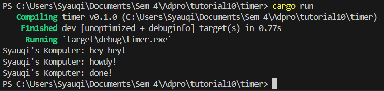

**Syauqi Armanaya Syaki** 
**2206829010** 
**Pemrograman Lanjut C** 

## 1.2. Understanding how it works

Berdasarkan hasil eksekusi diatas,output pertama yang muncul adalah "Syauqi's Komputer: hey hey!" baru kemudian perintah yang ada di dalam spawner. Hal ini bisa terjadi karena kode diletakkan sebelum `drop(spawner)` dan `executor.run()`. Baru setelahnya ketika executor dijalankan, maka output "Syauqi's Komputer: howdy!" akan muncul dan selang 2 detik output "Syauqi's Komputer: done!" muncul. Jadi kesimpulannya program akan tetap berjalan dan tidak ter blok saat menunggu task asinkronus selesai dijalankan.