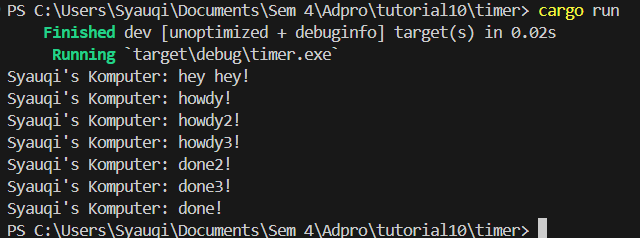
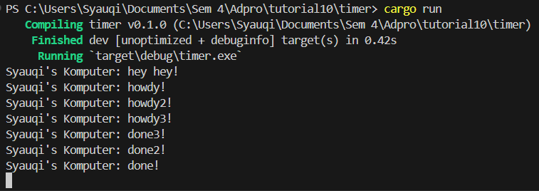
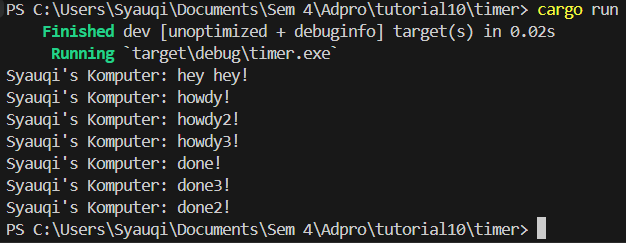

**Syauqi Armanaya Syaki** 
**2206829010** 
**Pemrograman Lanjut C** 

## 1.2. Understanding how it works

Berdasarkan hasil eksekusi diatas,output pertama yang muncul adalah "Syauqi's Komputer: hey hey!" baru kemudian perintah yang ada di dalam spawner. Hal ini bisa terjadi karena kode diletakkan sebelum `drop(spawner)` dan `executor.run()`. Baru setelahnya ketika executor dijalankan, maka output "Syauqi's Komputer: howdy!" akan muncul dan selang 2 detik output "Syauqi's Komputer: done!" muncul. Jadi kesimpulannya program akan tetap berjalan dan tidak ter blok saat menunggu task asinkronus selesai dijalankan.

## 1.3. Multiple Spawn and removing drop

**Multiple spawn**

**Removing `drop(spawner)`**

**Adding `drop(spawner)` again**

Berdasarkan hasil eksekusi diatas, saat multiple spawn dijalankan maka seluruh task yang dispawn akan jalan bersamaan, lalu ada timer 2 detik sebelum semuanya menampilkan output "done!". Jadi urutan munculnya output dapat bervariasi karena sifat asinkronus setiap task yang dieksekusi oleh executor menjalankan tasknya secara konkuren.

Lalu terlihat juga perbedaan saat `drop(spawner)` dihapus dan ditambahkan lagi. Saat dihapus maka artinya spawner akan tetap aktif meskipun semua task sudah ditambahkan, sehingga executor tetap menerima task baru untuk dijalankan meskipun di tutorial ini tidak ada lagi task baru yang menyebabkan program tidak akan berhenti. Berbeda saat `drop(spawner)` digunakan, maka executor akan mengetahui bahwa tidak ada lagi task baru yang ditambahkan, sehingga executor dapat berhenti setelah semua task selesai dijalankan.